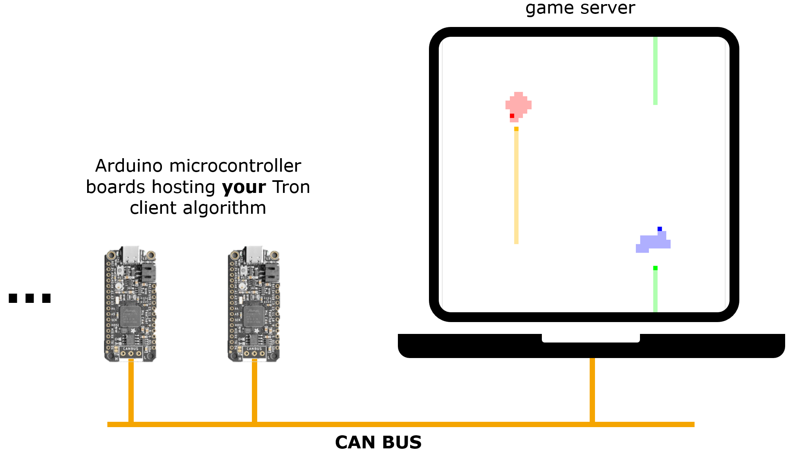
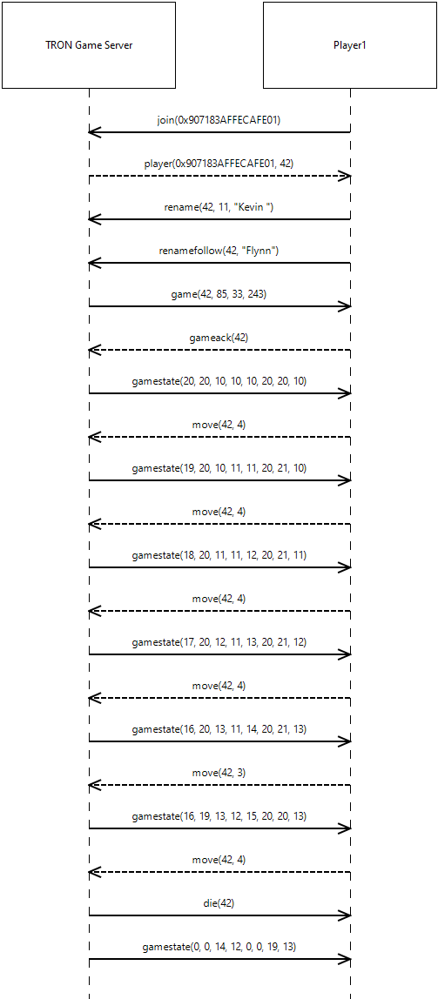

# Game Tron - Vector Hackathon

In our Game there are 4 players playing against each other on a single game grid. Depending on how early they crash, they'll be rewarded with points. The movements of each player is controlled by a dedicated program running on a small Arduino microcontroller board (very limited space for your smart artificial intelligence algorithms). A central game server sets up the game and regularly notifies about the game state (every 100ms) and who has crashed. The actual program that controls the player is designed and implemented by a team of about 4 people. There will be around 10 - 11 teams competing in a tournament of multiple 4-player games. The team with the most points in the end wins the competition.

## Game Setup:
- **Grid**: 64x64, toroidal (no walls, coordinates wrap at 0 and 63).

- **Players**: 4 players, each with a complete trail tracking their path.

- **Communication**: Game algorithm should run on a FeatherCAT board and the communication to the Game server is through CAN Protocol. 

## Objective: 
Survive longest to earn points based on survival time.

## Constraints:
- Avoid collisions with own trail.
- Avoid collisions with other players’ trails.

## Technical Setup

## Protocol Setup

